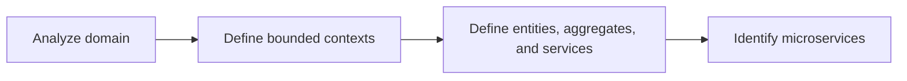
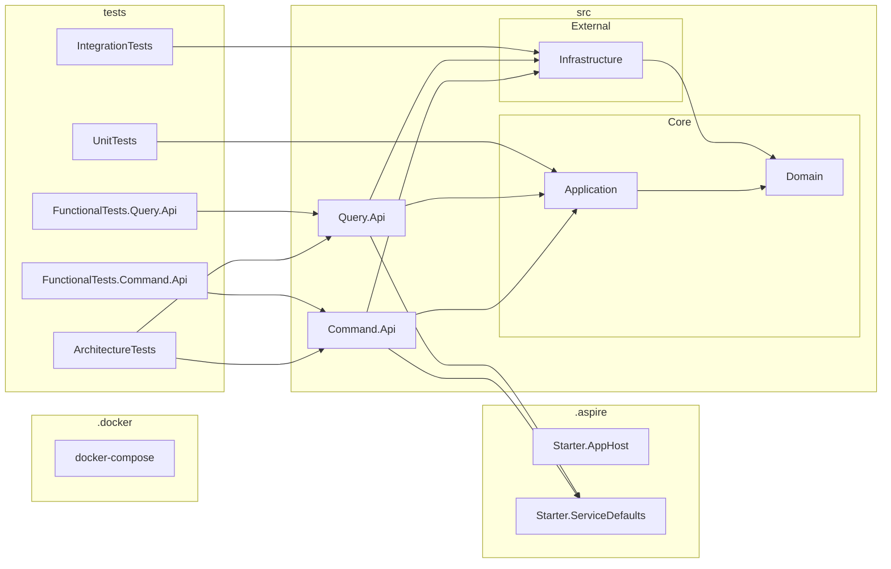

Assessment: Design an Expense Management System
===============================================

- [Scenario](#scenario)
- [Quick Start](#quick-start)
- [Design Flow](#design-flow)
- [Projects](#projects)

| Prerequisites | Recommended            | Alternative     |
| ------------- | ---------------------- | --------------- |
| IDE           | Visual Studio 2022[^1] | JetBrains Rider |
| Environment   | Docker                 |                 |

[^1]: The option [**Solution File Persistence Model**](https://devblogs.microsoft.com/visualstudio/new-simpler-solution-file-format/) must be enabled to support `.slnx`.

Scenario
--------

Fake, Inc. (a fictional company) is launching a new [expense management](https://en.wikipedia.org/wiki/Expense_management) service to handle a wide range of employee-initiated expenses. Authorized employees can submit expense claims, which are then reviewed and processed by relevant departments within the company.

This domain is inherently complex and spans multiple business concerns, including:

- Submitting and managing expense claims
- Auditing and approving expenses
- Tracking the processing lifecycle
- Managing employee profiles and entitlements
- Storing and analyzing historical financial data for compliance and insights

In addition to the domain complexity, the company is growing rapidly and prioritizes agility in delivering new features and scaling the system. The application is expected to:

- Operate at cloud scale
- Meet high service level objectives (SLOs)
- Support diverse and evolving data storage and querying needs across different functional areas

Given these requirements, a microservices architecture is a natural fit. It allows the system to be decomposed into independently deployable, domain-aligned services that can scale and evolve at different rates. This architecture also supports:

- Clear separation of concerns aligned with business capabilities
- Flexible technology choices per service (e.g., optimized storage engines or processing models)
- Improved resilience and fault isolation
- Faster iteration cycles for teams working on different parts of the system

As a result, Fake, Inc. has chosen a microservices approach to build a scalable, maintainable, and adaptable Expense Management platform.

Quick Start
-----------

**.NET Aspire** mode (recommended):

1. Open solution `Starter.slnx`
2. Launch `Starter.AppHost:https`
3. Wait for all resource nodes to be in the `Running` status then the Swagger UI of `Command.Api:https` and `Query.Api:https` will be automatically launched.

In the .NET Aspire Dashboard, you can access to the following built-in observability tools: **Resources**, **Console Logs**, **Structured Logs**, **Traces**, and **Metrics**.

---

**Docker compose** mode (alternative):

1. Run `docker compose -d` in Terminal from the root folder of the repository
2. Open solution `Stater.slnx`
3. Launch `Command.Api:https` and / or `Query.Api:https` to access the Swagger UI

Design Flow
-----------

| Exercise                                                                           | Input                                                                     | Output                                                                                         |
| ---------------------------------------------------------------------------------- | ------------------------------------------------------------------------- | ---------------------------------------------------------------------------------------------- |
| [Domain Analysis (Strategic DDD)](docs/1.Domain%20Analysis%20(Strategic%20DDD).md) | Scenario                                                                  | Subdomains > bounded contexts with integration > high-level architecture.                      |
| [Domain Modeling (Tactical DDD)](docs/2.Domain%20Modeling%20(Tactical%20DDD).md)   | Bounded contexts with integration                                         | Breakdown patterns: aggregate roots, entities, value objects, domain behaviors, domain events. |
| [Deep Dive: Expense Management](docs/3.Deep%20Dive%20-%20Expense%20Management.md)  | Breakdown patterns                                                        | Data model with dependencies for Expense Management service.                                   |
| [API Design (REST)](docs/4.API%20Design%20(REST).md)                               | Data models                                                               | A stateless, loosely coupled interface between a client and service.                           |
| [Clean Architecture](docs/5.Clean%20Architecture.md)                               | Use cases, business rules, and other key concepts.                        | Separates the business logic from the technical decisions..                                    |
| [Design Patterns](docs/6.Design%20Patterns.md)                                     | Common problems                                                           | Common approaches to solving similar problems.                                                 |
| [Testing](docs/7.Testing.md)                                                       | [Test Driven Design](https://deviq.com/practices/test-driven-development) | Definition and confirmation upon the software's behavior.                                      |

Projects
--------

