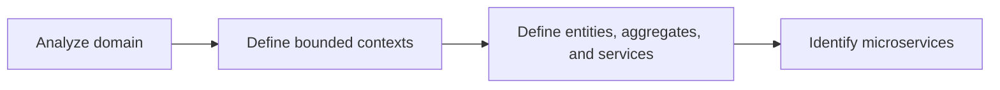

Assessment: Design an Expense Management System
===============================================

- [Scenario](#scenario)
- [Design Flow](#design-flow)

Scenario
--------

Fake, Inc. (a fictional company) is launching a new [expense management](https://en.wikipedia.org/wiki/Expense_management) service to handle a wide range of employee-initiated expenses. Authorized employees can submit expense claims, which are then reviewed and processed by relevant departments within the company.

This domain is inherently complex and spans multiple business concerns, including:

- Submitting and managing expense claims
- Auditing and approving expenses
- Tracking the processing lifecycle
- Managing employee profiles and entitlements
- Storing and analyzing historical financial data for compliance and insights

In addition to the domain complexity, the company is growing rapidly and prioritizes agility in delivering new features and scaling the system. The application is expected to:

- Operate at cloud scale
- Meet high service level objectives (SLOs)
- Support diverse and evolving data storage and querying needs across different functional areas

Given these requirements, a microservices architecture is a natural fit. It allows the system to be decomposed into independently deployable, domain-aligned services that can scale and evolve at different rates. This architecture also supports:

- Clear separation of concerns aligned with business capabilities
- Flexible technology choices per service (e.g., optimized storage engines or processing models)
- Improved resilience and fault isolation
- Faster iteration cycles for teams working on different parts of the system

As a result, Fake, Inc. has chosen a microservices approach to build a scalable, maintainable, and adaptable Expense Management platform.

Design Flow
-----------

```mermaid
flowchart LR
    Step1["Analyze domain"]
    Step2["Define bounded contexts"]
    Step3["Define entities, aggregates, and services"]
    Step4["Identify microservices"]

    Step1 --> Step2 --> Step3 --> Step4
```

| Exercise                                                                            | Input                             | Output                                                                                        |
| ----------------------------------------------------------------------------------- | --------------------------------- | --------------------------------------------------------------------------------------------- |
| [Strategic DDD: Domain Analysis](docs/1.Strategic%20DDD%20-%20Domain%20Analysis.md) | Scenario                          | Subdomains -> Bounded Contexts with Integration -> High-Level Architecture                    |
| [Tactical DDD: Domain Modeling](docs/2.Tactical%20DDD-%20Domain%20Modeling.md)      | Bounded Contexts with Integration | Breakdown Patterns: Aggregate Roots, Entities, Value Objects, Domain Behaviors, Domain Events |
| [Deep Dive: Expense Management](docs/3.Deep%20Dive%20-%20Expense%20Management.md)   | Breakdown Patterns                | Data Model with Dependencies for Expense Management Service                                   |
