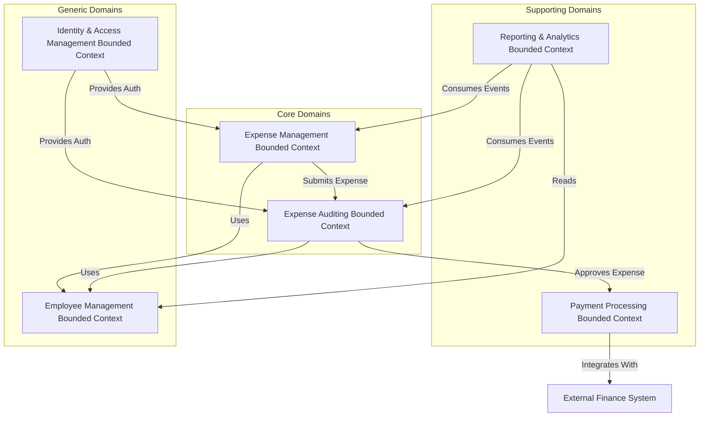
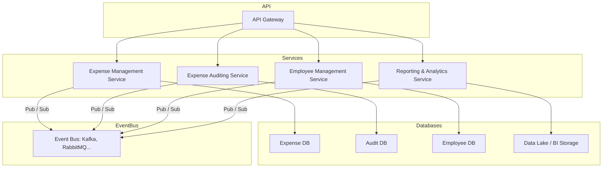

Domain Analysis (Strategic DDD)
===============================

- [Understand Core Business Processes](#understand-core-business-processes)
- [Identify Key Business Capabilities (Subdomains)](#identify-key-business-capabilities-subdomains)
- [Define Bounded Contexts and Integration](#define-bounded-contexts-and-integration)
- [High-Level Architecture](#high-level-architecture)

Analyzing the domain for the **Expense Management** scenario involves **Domain-Driven Design (DDD)** techniques, especially helpful when working toward a **microservices architecture**.

Using a DDD approach will help us to:

- Design microservices so that every service forms a natural fit to a functional business requirement
- Avoid the trap of letting organizational boundaries or technology choices dictate your design

Understand Core Business Processes
----------------------------------

From the scenario, the main business process is:

> **Authorized employees submit expense claims, which go through auditing and are processed for payment.**

Supporting activities include:

- Managing employees
- Keeping historical records, and
- Enabling reporting

Identify Key Business Capabilities (Subdomains)
-----------------------------------------------

| Subdomain                    | Type       | Description                                                                |
| ---------------------------- | ---------- | -------------------------------------------------------------------------- |
| Expense Management           | Core       | Enables employees to submit and track expenses. Business rules apply here. |
| Expense Auditing             | Core       | Handles approval flows, validations, and compliance checks.                |
| Employee Management          | Generic    | Manges employee data, and roles.                                           |
| Identity & Access Management | Generic    | Manges employee permissions.                                               |
| Payment Processing           | Supporting | Interfaces with external financial systems to reimburse employees.         |
| Reporting & Analytics        | Supporting | Aggregates data for finance, compliance, and optimization.                 |

> [!NOTE]
> **Core** domains are unique to our business and create competitive advantage.
> **Generic** and **Supporting** domains can often be built using standard patterns ot off-the-shell tools.

Define Bounded Contexts and Integration
---------------------------------------

Each subdomain maps to a **bounded context**.
Integration between contexts should use **well-defined APIs** or **events**:

- Expense Management publishes `ExpenseSubmitted` events
- Audit listens for an `ExpenseSubmitted` event, process it, and emits `ExpenseApproved` or `ExpenseRejected` events
- Payment Processing listener for `ExpenseApproved` events.

High-Level Architecture
-----------------------

Legend and rationale:

| Component                         | Description                                                                                                |
| --------------------------------- | ---------------------------------------------------------------------------------------------------------- |
| **API Gateway**                   | Entry point for client apps; handles routing, authentication, etc.                                         |
| **Expense Management Service**    | Handles creation and validation of expense records.                                                        |
| **Expense Auditing Service**      | Applies business rules and approvals.                                                                      |
| **Employee Management Service**   | Manages employee profiles, roles, and entitlements.                                                        |
| **Reporting & Analytics Service** | Aggregates historical data, generates reports, supports BI needs.                                          |
| **Service-specific databases**    | Each microservice owns its own data, enabling decoupling and optimized storage solutions.                  |
| **Async Messaging / Event Bus**   | Services communicate via events to ensure loose coupling and support scalability and eventual consistency. |
