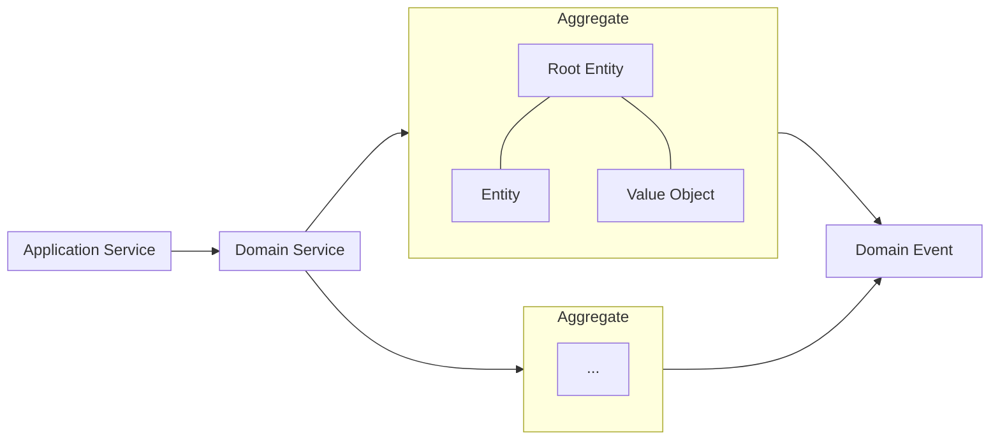

Domain Modeling (Tactical DDD)
==============================

The domain model is an abstract model of the business domain, which:

- Distills and organizes domain knowledge
- Provides a common language for developers and domain experts

We'll break down each domain into:

- Aggregate root
- Entities
- Value objects
- Domain behaviors
- Domain events (not shown in UML but can be noted)

For the rest of this design, we will focus on the [**Expense Management**](4.Expense%20Management.md) bounded context.
