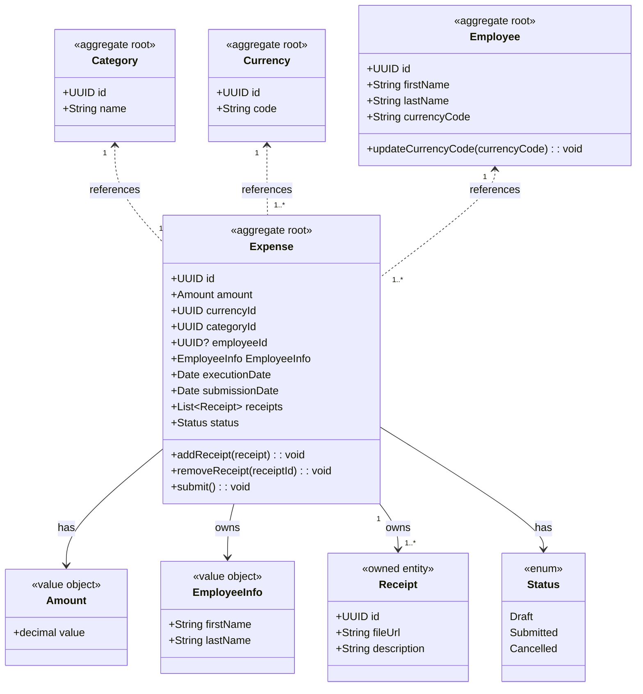

Deep Dive: Expense Management
=============================

- [Overview](#overview)
- [Aggregates](#aggregates)
- [Lifecycle Example](#lifecycle-example)
- [Domain Events](#domain-events)
- [Summary](#summary)

Overview
--------

This bounded context handles **the creation and management of expense claims**. It encapsulates the business rules,
data, and behaviors around:

- Submitting an expense
- Attaching receipts
- Categorizing and validating expense information
- Emitting events to downstream services (e.g. auditing)

It ends its responsibility when an expense is submitted for review.

Aggregates
----------

Several relationships between these entities are dependent on a principal entity.
Before deciding whether to enable cascade delete for these relationships, we need to carefully consider the implications.
Cascade delete automatically removes dependent records when the principal record is deleted, which can help maintain data integrity but may also lead to unintended data loss if not used appropriately.

| Principle-Dependent   | Cascade Delete? |
| --------------------- | --------------- |
| `Category`-`Expense`  | No.             |
| `Currency`-`Employee` | No.             |
| `Currency`-`Expense`  | No.             |
| `Employee`-`Expense`  | No.             |
| `Expense`-`Receipt`   | Yes.            |

Therefore, there should be 4 aggregates: `Category`, `Currency`, `Employee` and `Expense`-`Receipt`.

| Type           | Entities                                      |
| -------------- | --------------------------------------------- |
| Aggregate Root | `Category`, `Currency`, `Employee`, `Expense` |
| Owned Entities | `Receipt`                                     |
| Value Objects  | `Amount`, `Status`                            |

> [!NOTE]
>
> Why does `Expense` own a shadow `EmployeeInfo` in addition to referencing `EmployeeId`?
>
> The `Expense` aggregate includes an embedded `EmployeeInfo` value object (containing the employee's name) alongside the `EmployeeId` reference.
> This design ensures that expense records remain complete and auditable, even if the referenced employee is deleted or modified in the main system.
>
> Retaining a snapshot of employee details within each expense supports compliance and auditing requirements.
>
> Historical expense data must remain accessible and accurate, regardless of changes to employee records, so administrators can always review financial information in its original context.

Lifecycle Example
-----------------

A typical flow in this bounded context:

1. Employee creates a new `Expense` (in `Draft`)
2. Adds `receipts` via `addReceipt(receipt)`
3. Sets `amount`, `currency`, and `category`
4. Calls `submit()` which
    1. Validates that `amount > 0`, `receipts` exists, and `category` is valid
    2. Transitions the status to `Submitted`
    3. Emits an `ExpenseSubmitted` domain event

Domain Events
-------------

| Event              | Payload                       | Consumed by              |
| ------------------ | ----------------------------- | ------------------------ |
| `ExpenseSubmitted` | Expense ID, Employee ID, etc. | Expense Auditing context |
| `ExpenseCancelled` | Expense ID                    | Notifications service    |

These events support **eventual consistency** across services (e.g., auditing or reporting).

Summary
-------

- This UML model captures the **domain logic**, not just data structure.
- By structuring the domain in this way, we can enforce business rules inside the model, not scattered across services.
- The domain model is the core of the microservice in this context.
