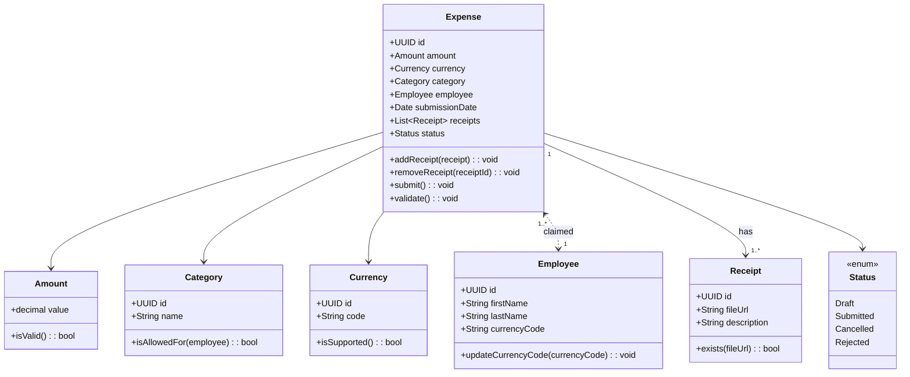

Expense Management
==================

- [Overview](#overview)
- [Aggregate Root: `Expense`](#aggregate-root-expense)
- [Entities](#entities)
- [Value Objects](#value-objects)
- [Lifecycle Example](#lifecycle-example)
- [Domain Events](#domain-events)
- [Summary](#summary)

Overview
--------

This bounded context handles **the creation and management of expense claims**. It encapsulates the business rules,
data, and behaviors around:

- Submitting an expense
- Attaching receipts
- Categorizing and validating expense information
- Emitting events to downstream services (e.g., auditing)

It ends its responsibility when an expense is submitted for review.

| Type           | Entities                          |
| -------------- | --------------------------------- |
| Aggregate Root | `Employee`, `Expense`             |
| Entities       | `Category`, `Currency`, `Receipt` |
| Value Objects  | `Amount`, `Status`                |

```mermaid
classDiagram
    %% Aggregate Root

    class Employee {
        +UUID id
        +String firstName
        +String lastName
        +String currencyCode
        +updateCurrencyCode(currencyCode): void
    }

    class Expense {
        +UUID id
        +Amount amount
        +Currency currency
        +Category category
        +Employee employee
        +Date submissionDate
        +List~Receipt~ receipts
        +Status status
        +addReceipt(receipt): void
        +removeReceipt(receiptId): void
        +submit(): void
        +validate(): void
    }

    %% Entity

    class Category {
        +UUID id
        +String name
        +isAllowedFor(employee): bool
    }

    class Currency {
        +UUID id
        +String code
        +isSupported(): bool
    }

    class Receipt {
        +UUID id
        +String fileUrl
        +String description
        +exists(fileUrl): bool
    }

    %% Value Objects
    
    class Amount {
        +decimal value
        +isValid(): bool
    }

    class Status {
        <<enum>>
        Draft
        Submitted
        Cancelled
        Rejected
    }

    %% Relationships

    Expense --> Amount
    Expense --> Category
    Expense --> Currency
    Expense "1..*" <..> "1" Employee: claimed
    Expense "1" --> "1..*" Receipt : has
    Expense --> Status
```

Aggregate Root: `Expense`
-------------------------

This is the central entity representing a claim, owning its invariants, such as:

- Must have at least one receipt
- Amount must be valid
- Cannot be re-submitted once in `Submitted` state

| Key Behaviors (Methods)    | Description                                                                                       |
| -------------------------- | ------------------------------------------------------------------------------------------------- |
| `addReceipt(receipt)`      | Adds a new receipt                                                                                |
| `removeReceipt(receiptId)` | Removes a receipt                                                                                 |
| `submit()`                 | Validates, changes state to `Submitted` and emit `ExpenseSubmitted` event to downstream services. |
| `validate()`               | Verifies business rules before submission.                                                        |

Entities
--------

| Definition | Description                                                         |
| ---------- | ------------------------------------------------------------------- |
| `Category` | May vary by department or region.                                   |
| `Currency` | Must be ISO 4217 currency code (e.g., CNY, EUR, USD, etc.)          |
| `Receipt`  | Tied to an expense instance and holds metadata about receipt files. |

Value Objects
-------------

| Definition | Description                                                     |
| ---------- | --------------------------------------------------------------- |
| `Amount`   | Only positive numbers; might have per-employee max limit logic. |
| `Status`   | Enum with state transitions managed by the aggregate.           |

These encapsulate rules and protect the domain from invalid values.

Lifecycle Example
-----------------

A typical flow in this bounded context:

1. Employee creates a new `Expense` (in `Draft`)
2. Adds `receipts` via `addReceipt(receipt)`
3. Sets `amount`, `currency`, and `category`
4. Calls `submit()` which
    1. Validates that `amount > 0`, `receipts` exists, and `category` is valid
    2. Transitions the status to `Submitted`
    3. Emits an `ExpenseSubmitted` domain event

Domain Events
-------------

| Event              | Payload                       | Consumed by              |
| ------------------ | ----------------------------- | ------------------------ |
| `ExpenseSubmitted` | Expense ID, Employee ID, etc. | Expense Auditing context |
| `ExpenseCancelled` | Expense ID                    | Notifications service    |
| `ReceiptAdded`     | Expense ID, Receipt ID        | Internal audit logs      |

These support **eventual consistency** across services (e.g., auditing or reporting).

Summary
-------

- This UML model captures the **domain logic**, not just data structure.
- By structuring the domain in this way, we can enforce business rules inside the model, not scattered across services.
- The domain model is the core of the microservice in this context.
